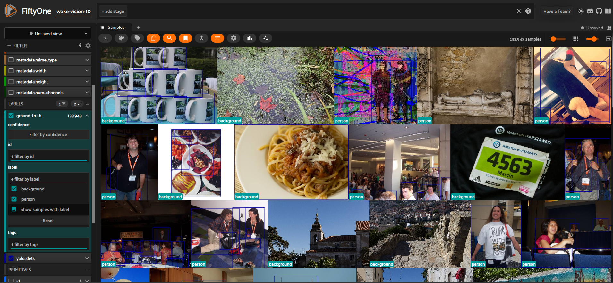

# 🚀 **Data-Centric Track**

This is my submission for the Data-Centric challenge described in [Challenge card](./wake_vision_challenge_description.md)

## Submission requirements

- [x] [tflite model](./wv_quality_mcunet-320kb-1mb_vww.tflite)

- [x] [Technical report](README.md)

- [x] [Data improvement script](data_filtering_workflow.py)


# Pre-requisites

## Setup environment

1- Create conda environment `conda create -n wakevision python=3.9`

and install the following requirements
```
pip install -U fiftyone
pip install ultralytics
pip install umap-learn
```

2 - Create A FiftyOne Dataset from the csv data and assign ground_truth label field to each sample. 

Create a 'dataset' folder and download the needed chunks of the Wake-Vision data
In my example I dowloaded wake-vision-10 (~7GB) + wake_vision_train_large.csv
Change column name in the .csv file to 'filepath'


Data can be found at [link](https://dataverse.harvard.edu/dataset.xhtml?persistentId=doi:10.791https://dataverse.harvard.edu/dataset.xhtml?persistentId=doi:10.7910/DVN/1HOPXC0/DVN/1HOPXC).


 ## Initializing the FiftyOne Data

```
# python3
import fiftyone as fo
wake_vision = fo.Dataset.from_dir(data_path="data", labels_path="data/wake_vision_train_large.csv", dataset_type=fo.types.CSVDataset, skip_missing_media=True, progress=True, include_all_data=True, persistent=True)
# Create a Label Field for Ground Truth
# Images with no GT are given a sample tag 'no_label'
with fo.ProgressBar() as pb:
    for sample in pb(wake_vision):
        if sample.person:
            if int(sample.person)==1:
                sample["ground_truth"] = fo.Classification(label="person")
                sample.save()
                continue
            elif int(sample.person)==0:
                sample["ground_truth"] = fo.Classification(label="background")
                sample.save()
                continue
        else:
            sample.tags.append('no_label')
            sample.save()

session = fo.launch_app(wake_vision)
```



## Data & Metadata
### Compute embeddings with Mobilenet  & Visualization
```
import fiftyone as fo
import fiftyone.zoo as foz
import fiftyone.brain as fob

wake_vision = fo.load_dataset('wake-vision-10')

wake_vision.compute_metadata()

embeddings_model = foz.load_model_zoo("mobilenet-v2-imagenet-torch")

wake_vision.compute_embeddings(model=embeddings_model, progress=True, 

embeddings_field="mobilenet_embeddings", skip_failures=True)

# Compute 2D Visualization using UMAP dimensionality reduction.
# pre-requisite: pip install umap-learn
results = fob.compute_visualization(
    wake_vision, 
    embeddings="mobilenet_embeddings", 
    brain_key="mobilenet_viz", 
    method="umap"
)

results_uniq = fob.compute_uniqueness(wake_vision, embeddings="mobilenet_embeddings")

results_representativeness = fob.compute_representativeness(
    wake_vision,
    embeddings="mobilenet_embeddings"
)
```


Check [data_filtering_workflow.py](./data_filtering_workflow.py) for the detailed integration of these methods

### Data Exploration

4-1. Look for wrong Ground_truth & Fix it
  The approach I followed here was to run a YOLO-object detection model to get multi-labels object detections.
  Then I selected images with 'person' object detections while having a 'background' ground truth class.
  ```
  # Load YOLO model and apply it to the data
  from ultralytics imoprt YOLO
  
  det_yolo = YOLO("yolo11m.pt")

  wake_vision.apply_model(det_yolo, label_field="yolo_dets" ...)

  wrong_person_data = (wake_vision.
    match_labels(fields="ground_truth", filter=fo.ViewField("label")=='person').filter_labels("yolo_dets", fo.ViewField("label")!="person")
  )
```

This will expose mislabelling cases like the image below:


```python
  with fo.ProgressBar() as pb:
    for sample in pb(wrong_backgorund_data):
       sample.ground_truth.label = "person"
       sample.person = int(1)
       sample.save()
```

Inversely I select images with ground_truth value as background, and then I lookfor yolo-detection with class `person`. Most of these cases would represent a falsely labeled image.


### Unsupervised labelling of non-labeled images

```python
person_images = vw.match_tags('no_label').match_labels(fields="yolo_dets", filter=fo.ViewField("label")=="person").filter_labels("yolo_dets", fo.ViewField("confidence")>0.4)
with fo.ProgressBar() as pb:
  for sample in pb(person_images):
    sample['ground_truth'] = fo.Classification(label="person")
    sample['person'] = '1'
    sample.tags.remove('no_label')
    sample.tags.append('person')
    sample.save()

# Assuming remaining images are background images
background_images = vw.match_tags('no_label')
with fo.ProgressBar() as pb:
  for sample in pb(background_images):
    sample['ground_truth'] = fo.Classification(label="background")
    sample['person'] = '0'
    sample.tags.remove('no_label')
    sample.tags.append('background')
    sample.save()
```

## Model training

### 1st experience

First, I exported the unmodified `wake-vision-10` to a Classification Directory dataset
```
train_ds = ...

train_ds.export(
    export_dir=(EXPORT_DIR, 'train'),
    dataset_type=fo.types.ImageClassificationDirectoryTree,
    label_field="ground_truth",
    export_media=True,
)
val_ds = ...
val_ds.export(
    export_dir=(EXPORT_DIR, 'val'),
    dataset_type=fo.types.ImageClassificationDirectoryTree,
    label_field="ground_truth",
    export_media=True,
)
test_ds = ...
test_ds.export(
    export_dir=(EXPORT_DIR, 'test'),
    dataset_type=fo.types.ImageClassificationDirectoryTree,
    label_field="ground_truth",
    export_media=True,
)
```
```
dataset

└───train
│   │
│   └───person
│   |   │   file111.jpg
│   |   │   file112.jpg
│   │   │   ...
│   └───background
│   |   |   file211.jpg
|   |   |   file212.jpg
└───val
|   |   ...
|
|
└───test
|   |   ...
```
Then I used the provided docker image by doing the following changes:

```python
# Load training dataset
train_ds = tf.keras.utils.image_dataset_from_directory(
    dataset_path + "/train",
    image_size=(144, 144),  # Resize images to match model input
    batch_size=32,
    shuffle=True
)
# Load validation dataset
val_ds = tf.keras.utils.image_dataset_from_directory(
    dataset_path + "/val",
    image_size=(144, 144),  # Resize images to match model input
    batch_size=32,
    shuffle=True
)
# Load testing dataset
test_ds = tf.keras.utils.image_dataset_from_directory(
    dataset_path + "/test",
    image_size=(144, 144),  # Resize images to match model input
    batch_size=1,
    shuffle=True
)
#some preprocessing 
data_preprocessing = tf.keras.Sequential([
    #resize images to desired input shape
    tf.keras.layers.Resizing(input_shape[0], input_shape[1])])

#try your own data augmentation recipe!
data_augmentation = tf.keras.Sequential([
    data_preprocessing,
    #apply some data augmentation 
    tf.keras.layers.RandomFlip("horizontal"),
    tf.keras.layers.RandomRotation(0.2)])

# Customization: Batching is removed from the following data loading steps not to add an extra dimension    
train_ds = train_ds.shuffle(1000).map(lambda x, y: (data_augmentation(x, training=True), y), num_parallel_calls=tf.data.AUTOTUNE).prefetch(tf.data.AUTOTUNE)
val_ds = val_ds.map(lambda x, y: (data_preprocessing(x, training=True), y), num_parallel_calls=tf.data.AUTOTUNE).prefetch(tf.data.AUTOTUNE)
test_ds = test_ds.map(lambda x, y: (data_preprocessing(x, training=True), y), num_parallel_calls=tf.data.AUTOTUNE).batch(1).prefetch(tf.data.AUTOTUNE)
```

```bash
sudo docker run --gpus all -it --rm -v $PWD:/tmp -v $PWD/dataset:/tmp/data -w /tmp andregara/wake_vision_challenge:gpu python data_centric_track.py
```
This created a Baseline .tflite VWW_MCU_NET model to compare with, named "vww_mcu_net_baseline.tflite"

### 2nd experience

After doing data improvements with Fiftyone, I similarily export the newly obtained **labeled** dataset to a Classification Directory and re-run training with **same hyperparameters**.

This created the checkpoint "wv_quality_mcunet-320kb-1mb_vww.tflite" which achieved `Tflite model test accuracy: 0.7102` over local test set